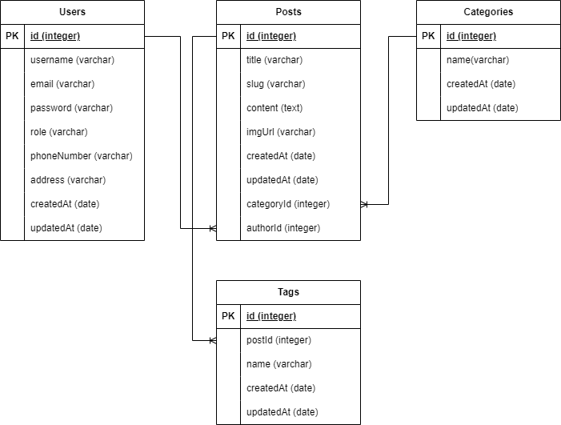

# Brand-showcase

Clone of the CNN Indonesia website and mobile application. An application (web-based CMS, and mobile-based user-facing app) to showcase a brand.

## Application Demo CMS-Web

## Technical Overview

### Tech Stack CMS-Web

- ReactJS
- Redux
- Bootstrap
- ExpressJS
- Tailwind
- Sequelize ORM
- PostgreSQL Database

### Database Schema CMS-Web

### How to Run Front-end CMS-Web

`client-admin`: [cms-web/client-admin/README.md](cms-web/client-admin/README.md) 
`client-user`: [cms-web/client-user/README.md](cms-web/client-user/README.md)

### How to Run Back-end CMS-Web

`server` : [cms-web/server/README.md](cms-web/server/README.md)

## Application Demo Mobile-App

currently not available because the project is using old dependencies 12/1/2025

## Technical Overview

### Tech Stack Mobile-App

client-mobile-app:
- expo
- react-native
- apollo-client(graphql)

serverDocker/orchestrator-express and serverDocker/orchestrator-graphql dependent on serverDocker/services/app and serverDocker/services/users, `both services app and users must be turn on!!`

serverDocker/orchestrator-express:
- express
- redis
- mongodb
- postgresql

serverDocker/orchestrator-graphql:
- express
- graphql
- redis
- mongodb
- postgresql

`orchestrator-express` is used for backend http request, and `orchestrator-graphql` is used for the Mobile-App client app.

Created by : satriadega
